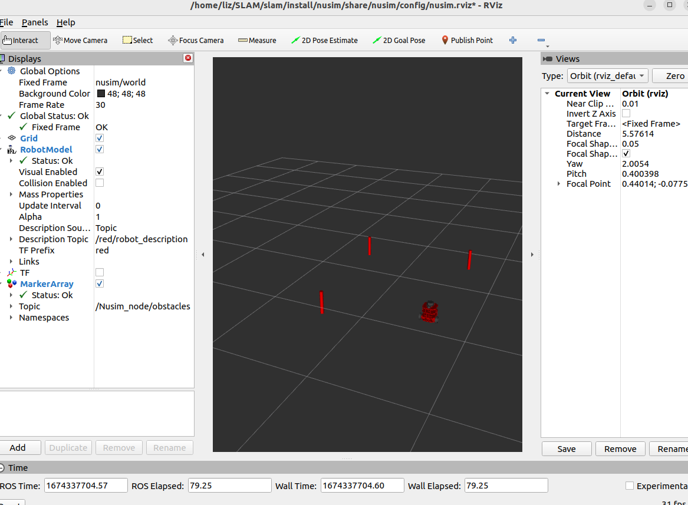

 # Nuturtle  Description
This package is runs a node that simulates and visulizes a turtlebot in rviz with obstacles surrounding it at locations designated by the user. The services in this package allow for the robot's position to be reset or teleported to a designated location. 

To launch a single robot in RVIZ with the node run the following command:
`ros2 launch nusim nusim.launch.xml `

To call the teleport service:
`ros2 service call /Nusim_node/teleport nusim/srv/Teleport "{x: 2.0,y: 1.5,theta: 0.5}"`

To call the reset service: 
`ros2 service call /Nusim_node/reset_counter std_srvs/srv/Empty`

The parameters of this package can be set in the yaml and are as follows:
rate: the rate at which teh timer_callback funciton is called
x: x coordinate of the turtlebot
y: y coordinate of the turtlebot
theta: theta value of the turtlebot
obstacles/x: a list of x coordinates for obstacles
obstacles/y: a list of y coordinates for obstacles
obstacles/r: radius of all of the obstacles

Worked With <Meg, Oubre, Dilan, Marno, Ava, Katie, Nick, Shantao, Rintaroh>