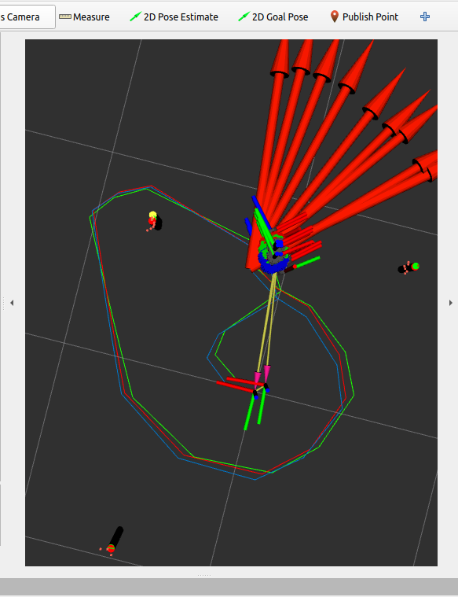

To launch the SLAM package with teleop locally run the following command:

`ros2 launch nuslam slam.launch.xml cmd_src:=teleop robot:=nusim`

Here is what my robots and path look like after driving around for a little bit (without hitting any objects):

This is what it looks like after running into a couple of objects:

Noise settings for the above picture:
input_noise=0.01
slip_fraction=0.001
basic_sensor_variance=0.01

Kalman filter weightings:
Q=.1
R=.1

To launch the SLAM package with unknown data association and teleop run the following command:
`ros2 launch nuslam unknown_data_assoc.launch.xml cmd_src:=teleop`

Here is a video of SLAM with unknown data association:

[Data_Association.webm](https://user-images.githubusercontent.com/113066141/225763613-557f5e5c-a896-4481-9c8a-e2eb988461d3.webm)

Red robot coord: (-0.1081, -0.34401)
Blue robot coord: (-0.09724, -0.41067)
Green robot coord: (-0.08845, -0.33024)

Error between actual robot position (red) and odometry (blue):
0.0675m

Error between actual robot position (red) and the SLAM estimate (green):
0.02399m