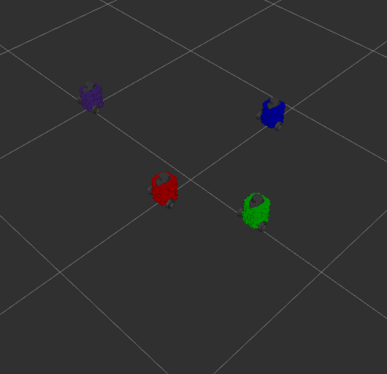

 # Nuturtle  Description
URDF files for Nuturtle Wallace.
* `ros2 launch nuturtle_description load_one.launch.py` to see the robot in rviz.
* `ros2 launch nuturtle_description load_all.launch.xml` to see four copies of the robot in rviz.

* The rqt_graph when all four robots are visualized (Nodes Only, Hide Debug) is:

# Launch File Details
* `ros2 launch nuturtle_description load_one.launch.py --show-args`
  `Arguments (pass arguments as '<name>:=<value>'):

    'use_rviz':
        controls whether rviz is launched. Valid choices are: ['true', 'false']
        (default: 'true')

    'link':
        set the fixed frame in rviz. Valid choices are: ['base_link', 'base_scan', 'caster_back_link', 'imu_link', 'wheel_left_link', 'wheel_right_link', 'base_footprint']
        (default: 'base_link')

    'use_jsp':
        controls whether the joint_state_publisher is used. Valid choices are: ['true', 'false']
        (default: 'true')

    'color':
        controls the color of the base of the robot. Valid choices are: ['purple', 'red', 'green', 'blue']
        (default: 'purple')`

* `ros2 launch nuturtle_description load_all.launch.xml --show-args`
  `Arguments (pass arguments as '<name>:=<value>'):

    'use_rviz':
        controls whether rviz is launched. Valid choices are: ['true', 'false']
        (default: 'true')

    'link':
        set the fixed frame in rviz. Valid choices are: ['base_link', 'base_scan', 'caster_back_link', 'imu_link', 'wheel_left_link', 'wheel_right_link', 'base_footprint']
        (default: 'base_link')

    'use_jsp':
        controls whether the joint_state_publisher is used. Valid choices are: ['true', 'false']
        (default: 'true')

    'color':
        controls the color of the base of the robot. Valid choices are: ['purple', 'red', 'green', 'blue']
        (default: 'purple')`

Worked With <Meg, Oubre, Dilan, Marno, Ava, Katie, Nick>